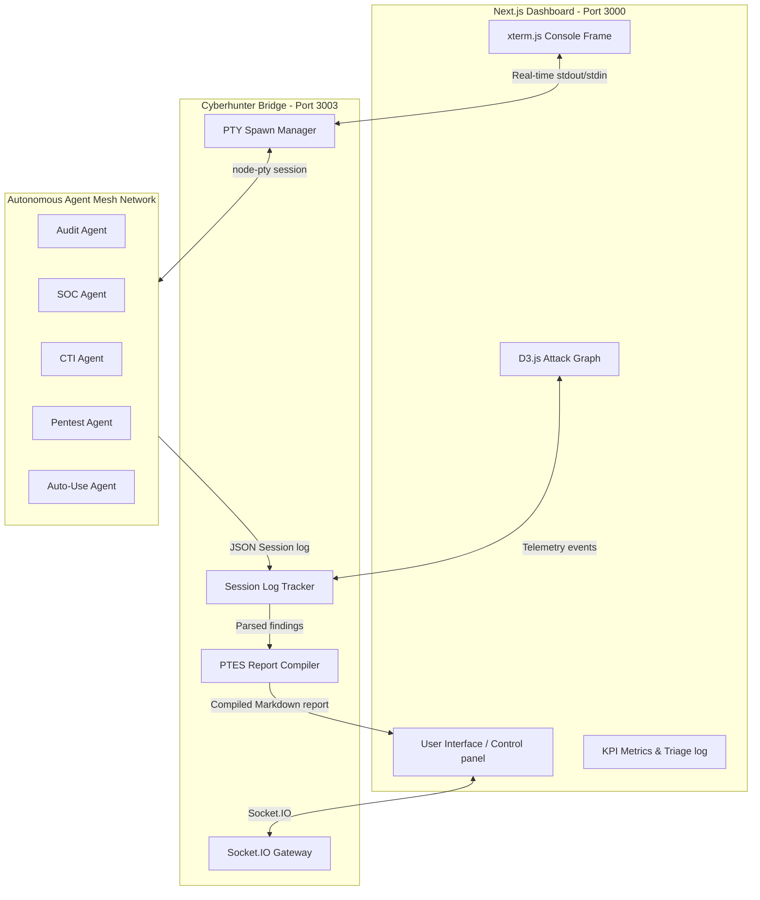
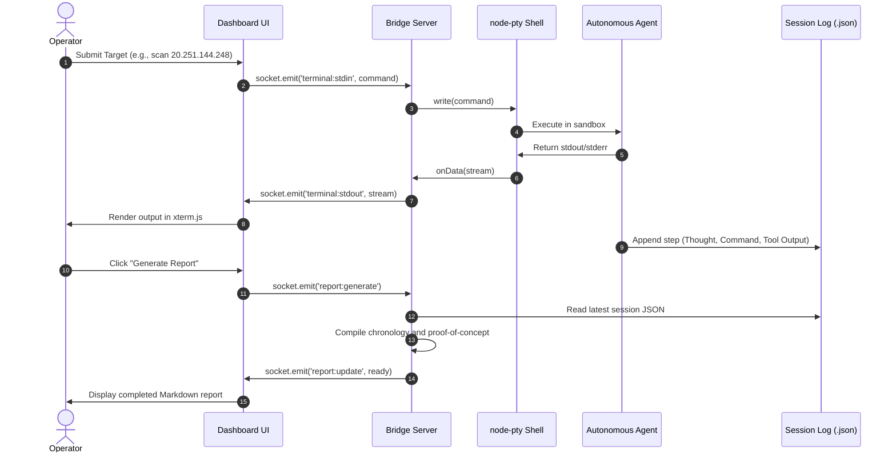
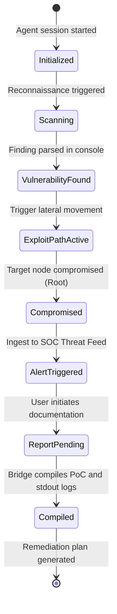

<div align="center">

# CYBERHUNT COMMAND CENTER
### Autonomous Multi-Agent Cybersecurity Operations & Orchestration Hub

---

[](https://nextjs.org/)
[](https://react.dev/)
[](https://www.typescriptlang.org/)
[](https://tailwindcss.com/)
[](https://socket.io/)
[](https://github.com/microsoft/node-pty)

---

<p align="center">
  CYBERHUNT Command Center is an enterprise-grade cybersecurity operations dashboard that coordinates a mesh network of autonomous, highly specialized security agents directly within your local workspace. Featuring low-latency terminal emulators (xterm.js), dynamic force-directed attack topology graphs (D3.js), live SOC-style threat logging, and an integrated chronological report compiler, the dashboard enables streamlined automated testing and auditing.
</p>

</div>

---

## 

*   **Attack Path Visualization** — Dynamic force-directed network topology mapping that renders active exploit routes, node compromises, and lateral movements in real time.
*   **Low-Latency Terminal PTYs** — Multiple resizable, high-performance terminal consoles (`node-pty`) connected directly to active agent sandboxes over Socket.IO.
*   **Triage Logging Feed** — Real-time event log streaming with threat classification tags mapping adversarial behaviors directly to mitigation rules.
*   **Performance Metrics Dashboard** — Interactive status gauges tracking open security incidents, MITRE ATT&CK coverage percentage, network uptime, and overall workspace risk scores.
*   **Automated Audit Compiler** — Local Markdown reporter that compiles detailed PTES-compliant event records and command execution logs from terminal sessions.

---

## 

<div align="center">
  <p>
    The CYBERHUNT dashboard separates user interaction, state orchestration, and sandbox task execution into distinct, modular tiers connected via real-time WebSocket events.
  </p>
</div>



---

## 

<div align="center">
  <p>
    This diagram demonstrates the asynchronous execution pipeline, showcasing how input command data maps to standard streams, and how session logs are stored and dynamically compiled into Markdown.
  </p>
</div>



---

## 

<div align="center">

| Agent | Module Badges | Core Responsibility | Framework Alignment |
| :--- | :--- | :--- | :--- |
| **AUDIT** |  | Compliance checks, directory access-control reviews, encryption auditing, and credential leak sweeps. | SOC2 Trust Criteria / ISO 27001 |
| **SOC** |  | SIEM log monitoring, telemetry correlation, threat ingestion, and endpoint containment. | NIST SP 800-61 Rev 2 |
| **CTI** |  | Threat intelligence gathering, OSINT searches, adversary profiling, and TTP mapping. | MITRE ATT&CK Framework |
| **PENTEST** |  | Automated reconnaissance, vulnerability validation, SQL Injection checking, and exploit route execution. | PTES / OWASP Top 10 |
| **AUTO-USE** |  | Desktop GUI task execution, browser automation, and integration of external security tools. | Playwright / PyAutoGUI |

</div>

---

## 

<div align="center">
  <p>
    The lifecycle of a targeted mission propagates through discrete agent threat states before triggering active playbooks and report compilations.
  </p>
</div>



---

## 

<div align="center">
  <p>
    The entire cognitive operations engine of the CYBERHUNT agent mesh is powered by the Gemini API Key. This key must be present in the shell configuration files of each agent workspace to enable reasoning, tool selection, and script execution.
  </p>
</div>

### Setting up the API Key

Export your API token locally in the shell scripts of the respective agents:

```bash
# Add to agent startup shell scripts (e.g. xhunter.sh)
export GEMINI_API_KEY="your_gemini_api_key_here"
```

Verify that the key is exported correctly in the following entrypoints:

*   `auditAGENT/xhunter-working/xhunter.sh`
*   `ctiAGENT/xhunter-working/xhunter.sh`
*   `socAGENT/xhunter-working/xhunter.sh`
*   `pentestAGENT/xhunter-working/xhunter.sh`

### Supported Cognitive LLM Providers

While the orchestrator is optimized around the Google Gemini API, the underlying multi-agent framework supports multiple remote and local models through configuration aliases:
*   **Google Gemini** (Gemini 1.5 Pro, Gemini 1.5 Flash)
*   **Anthropic Claude** (Claude 3.5 Sonnet, Claude 3.0 Opus)
*   **OpenAI GPT** (GPT-4o, GPT-4-turbo)
*   **DeepSeek** (DeepSeek-V3, DeepSeek-R1)
*   **OpenRouter API** (Routing to Llama-3, Mistral, Grok, Qwen)
*   **Local Models** (Ollama, local vLLM servers)

---

## 

*   **Prompt Injection Mitigation** — Strict separation between user-provided inputs and agent system instructions. Input validation parsers isolate target strings, preventing secondary command injection attempts from altering agent behavioral models.
*   **Process & Shell Sandboxing** — All commands are scoped under local workspace boundaries using shell wrappers. Restricted execution paths prevent access to sensitive home directory dotfiles.
*   **Secure API Handling** — API keys are kept strictly in-memory or loaded via ephemeral local environments. No secrets are stored in state caches or exfiltrated via Socket.IO payloads.
*   **Safety Overrides** — Strict pre-validation of target formats (e.g., matching target IP patterns) prevents agents from executing lateral sweeps outside the designated testing scope.

---

## 

*   **Low-Latency node-pty Bridge** — Real-time stdin/stdout mirroring between Next.js terminals and native shells, eliminating polling delay.
*   **Token-Optimized Caching** — Minimizes LLM token overhead by only sending recent terminal contexts and state updates rather than full command histories.
*   **Asynchronous Processing** — Multi-threaded execution in the bridge backend allows all 5 agents to execute sweeps and log parsing concurrently without blocking the main dashboard render loop.

---

## 

*   **Strict State Tracking** — Structured JSON log storage matches thoughts, tool parameters, execution status, and raw terminal stdout streams chronologically.
*   **Deduplication Filters** — Bridge filters duplicate warning sequences and redundant shell logs to keep state representations clean.
*   **Transaction-Grade History** — Backup structures persist log histories even during server restarts, preventing telemetry loss during long-running testing campaigns.

---

## 

<p align="center">
  The system bridge backend manages terminal streams and translates them into comprehensive security assessment records. When a report is requested, the compiler parses the session data and writes a standard-compliant report featuring the following key components:
</p>

1.  **System Posture Overview** — Calculations of risk exposure, mitigation state, and node vulnerabilities.
2.  **Attack Chronology** — Step-by-step logs tracking the exact objective, executed shell command, status (Success/Failure), and raw console stdout evidence.
3.  **Remediation Action Plan** — Prioritized checklists for patching vulnerabilities discovered during the run.

---

## 

### Prerequisites
*   Node.js 18+
*   npm or bun

### 1. Install Project Dependencies
Run install in both the root dashboard directory and the bridge backend service:
```bash
# Install frontend dashboard package dependencies
npm install

# Install bridge backend dependencies
cd mini-services/cyberhunter-bridge
npm install
cd ../..
```

### 2. Launch Server Services
Run the centralized startup script to initialize the bridge backend and dashboard server:
```bash
chmod +x start-cyberhunter.sh
./start-cyberhunter.sh
```

To re-compile and bundle the production Next.js application, append the build flag:
```bash
./start-cyberhunter.sh --build
```

Open your browser to `http://localhost:3000` to view the active console dashboard.
